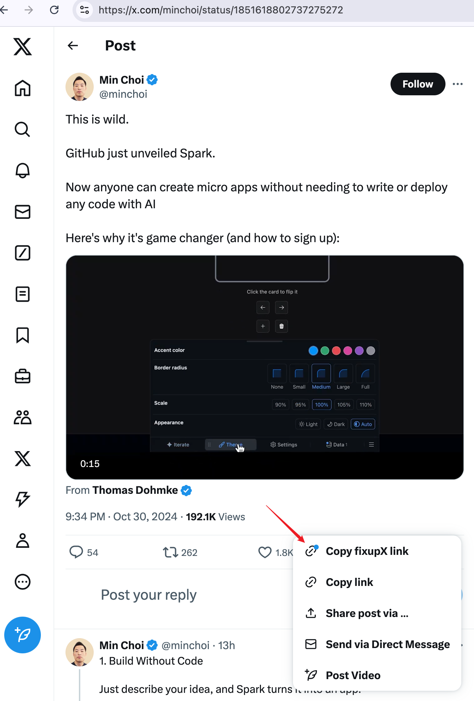

# tampermonkey-userscripts-copy-fixupx-link

剪切X(twitter)分享链接自动转化成fixupX链接，方便分享到Telegram等平台进行Instant View

Automatically convert copied X (Twitter) share links to fixupX format, enabling Instant View when sharing on Telegram and other platforms.

## 使用方法 | Usage

1. 浏览器安装Tampermonkey插件或Greasemonkey插件
   Install Tampermonkey or Greasemonkey extension in your browser

2. 通过[OpenUserJS的链接](https://openuserjs.org/scripts/tyounami/FixupX_share_link)安装脚本
   Install the script via [OpenUserJS link](https://openuserjs.org/scripts/tyounami/FixupX_share_link)

3. 点击分享按钮，第一个MenuItem将是复制FixupX的链接
   Click the share button, the first menu item will be "Copy FixupX link"

